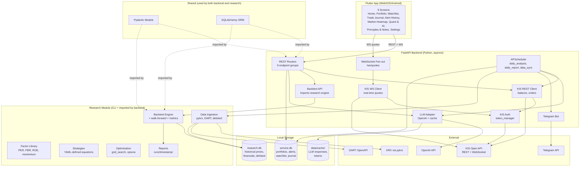

# 프로젝트 공식 문서 — Project Blueprint

> **Audience**: AI developers (Claude Code & Codex) joining this project.
> **Purpose**: Single Source of Truth (SSOT). Do not deviate from this architecture without explicit user approval.
> **Last Updated**: 2026-06-09
> **Status**: ✅ **Phase 5 COMPLETE** — full 9-screen Flutter UI live against Phase 6 backend (broker sync worker + LLM journal analyzer + macOS daemon). Next phases = V2 features (real-money flow, Postgres migration, US equities).

---

## 🚀 Current Progress Tracker (DO NOT OVERWRITE EXISTING WORKING CODE)

- **[DONE] Phase 0 (Bootstrap):** Pydantic domain models, SQLAlchemy ORM, Alembic migrations (`service.db`, `research.db` initialized).
- **[DONE] Phase 1 (KIS Connectivity):** FastAPI setup, KIS REST authentication, WebSocket real-time fan-out (`H0STCNT0`), Portfolio basic REST API.
- **[DONE] Phase 2 (Data Ingestion):** `pykrx` and DART loaders created. Tested with sample data.
- **[DONE] Phase 3 (Backtest Engine):** **[CODEX]** Factor modules, simulator, walk-forward, metrics in `research/`.
- **[DONE] Phase 4 (Batch & LLM):** **[CODEX]** APScheduler, LLM commentary, real `/api/portfolio/*`, `/api/quant/undervalued`, `/api/watchlist/*`, `/api/trade-journal/*`, `/ws/quotes` live at `http://127.0.0.1:8000`. CORS middleware open to `http://(localhost|127.0.0.1):*`.
- **[IN PROGRESS] Phase 5 (Flutter UI):** **[CLAUDE CODE]**
  - ✅ Step 1–2: skeleton + Home Dashboard + go_router shell + Mock interceptor toggle
  - ✅ Step 3 (2026-05-28): real Dio wiring, `quotesProvider` (`/ws/quotes` notifier w/ auto-reconnect + per-code `.select()`), Portfolio full impl (3-account segment + live-price blink), Settings full impl with graceful fallback for `/api/settings` (still pending on backend)
  - ✅ Step 4 (2026-06-08): Quant & AI Insights (LLM markdown via `flutter_markdown`, Top N cards, heatmap placeholder), Watchlist full CRUD (category tabs w/ create/edit/delete, entry add/edit/delete with REASON), Trade Journal (Missing tab → POST create, 전체 tab → PATCH edit reason + post_review)
  - ✅ Step 4.5 (2026-06-09): Settings → KOSPI200 universe sync button (`POST /api/settings/universe/kospi200/refresh`, 60s timeout) with status-code branching (200 = 공식 KRX / 203 = Wikipedia fallback / 206 = approximate cache), in-place outcome card (prev→curr count + added/removed diff), SnackBar feedback per branch
  - ✅ Step 5 (2026-06-09): **Heatmap full impl** — in-house squarified treemap layout, color-mapped pct change (red↑/blue↓), per-cell modal sheet. Dedicated `/heatmap` screen + mini-heatmap embedded in Insights tab. **Order BottomSheet** — live WS price + 시장가/지정가 + qty stepper + 예상 체결대금. **Alerts full impl** — `/alerts` screen w/ status filters, create dialog, cancel + post-mortem PATCH. **AI Journal feedback UI placeholder** (later rebound to direct LLM cols in Step 6)
  - ✅ Step 6 (2026-06-09): Broker order sync UI, Journal LLM live binding, Principles full CRUD, Backtest runs leaderboard + detail dashboard, EmptyState polish sweep
  - ✅ **Step 7 (THIS SESSION 2026-06-09 — Phase 5 FINALE)**: **Equity Curve chart** — `_EquityCurveCard` w/ `fl_chart` LineChart on backtest detail (red↑/blue↓ gradient fill, dashed initial-NAV baseline, hover tooltip with date+NAV+%, 4-step date axis, smart NAV labels e.g. "1.5억"). Result trades + warnings cards bonus-rendered for fresh runs. **Sparkline widget** — pure CustomPainter w/ baseline + gradient fill + last-point dot, deterministic dummy data seeded by stock_code (`Sparkline.fromCodeDummy`). Embedded in Portfolio order BottomSheet header (placeholder pending backend price-history endpoint). **Equation Builder** at `/quant/builder` — full StrategyDefinition composer: meta (name/description), universe ChoiceChip (KOSPI200/KOSPI_ALL/KOSDAQ_ALL/CUSTOM), rebalance ChoiceChip (월/분기/연), **factor section** with curated catalog (MOMENTUM_1M/3M/6M/12M, PER/PBR/PSR, ROE/ROA, 배당) + per-factor weight slider (0–100%) + transform dropdown (RAW/ZSCORE/RANK) + 합계 라이브 표시 + [정규화] auto-normalize button, **filter section** with 6 field options + 4 ops + numeric value, **Top N** stepper + date range pickers, live JSON preview card, [백테스트 실행] FAB → `POST /api/backtest/run` w/ 5-min timeout → caches full result in `recentRunResultsProvider` (in-memory map by run_id) → auto-navigates to detail screen where equity curve renders immediately
  - 🔜 V2: real-money order automation, PostgreSQL migration, US equities, FCM push, mobile QA (iOS/Android), Alerts calendar view

---
## Table of Contents

1. [Executive Summary](#1-executive-summary)
2. [Problem & Vision](#2-problem--vision)
3. [Tech Stack](#3-tech-stack)
4. [High-Level Architecture](#4-high-level-architecture)
5. [Repository Layout](#5-repository-layout)
6. [Domain Model](#6-domain-model)
7. [Database Schema](#7-database-schema)
8. [API Contracts](#8-api-contracts)
9. [Screen Specifications](#9-screen-specifications)
10. [KIS API Integration Playbook](#10-kis-api-integration-playbook)
11. [Research Module — Backtest Engine](#11-research-module--backtest-engine)
12. [LLM Integration Strategy](#12-llm-integration-strategy)
13. [Telegram Notification](#13-telegram-notification)
14. [Development Roadmap](#14-development-roadmap)
15. [Conventions](#15-conventions)
16. [Setup Guide](#16-setup-guide)
17. [Critical Pitfalls & Anti-Patterns](#17-critical-pitfalls--anti-patterns)
18. [Glossary & References](#18-glossary--references)

---

## 1. Executive Summary

**Q-Lab** (short for **QuantLab**) is a single-user, cross-platform (Web / iOS / Android) personal stock-trading and research application built around the Korea Investment & Securities (KIS) Open API. It unifies three KIS accounts (live ordinary, live ISA, paper/simulated) into one portfolio view, streams real-time prices via WebSocket (no REST polling), runs a daily batch that ranks undervalued stocks against a user-defined value equation, generates LLM commentary, sends Telegram alerts when price/condition thresholds are met, and includes an in-app **Backtest Lab** that lets the user design and validate value equations against 10 years of historical Korean market data — all in one monorepo.

| Dimension | Number |
|---|---|
| Service screens | **9** (Home, Portfolio, Watchlist, Trade Journal, Alert History, Market Heatmap, Quant & AI [2 tabs], Principles & Notes, Settings) |
| KIS accounts | **3** (live ordinary / live ISA / paper) |
| Local SQLite DBs | **2** (`service.db` for runtime, `research.db` for historical) |
| Development phases | **6** (Phase 0 bootstrap → Phase 5 Flutter UI) |
| Backtest report artifacts per run | **5** files in a timestamped folder |
| External APIs | **5** (KIS REST, KIS WebSocket, OpenAI, Telegram Bot, DART OpenAPI) |

---

## 2. Problem & Vision

### 2.1 The Problem

Commercial Korean HTS (Home Trading System) and MTS (Mobile Trading System) clients cannot simultaneously satisfy:

1. **Unified 3-account view** across live ordinary, ISA, and paper accounts — they typically show only the currently logged-in account.
2. **User-defined value-equation backtesting** — they offer canned indicators but no way to define `score = w1*PER + w2*PBR + w3*ROE + …` and validate it on 10 years of historical data while preventing look-ahead and survivorship biases.
3. **LLM-based qualitative analysis** of why a stock is currently undervalued, beyond raw indicator dumps.
4. **Decision-context tracking** — linking each trade to *why* it was made and *which personal principle* was applied, for post-mortem learning.

### 2.2 The Vision

A single tool the user opens every morning that answers:
- What did my portfolio do overnight?
- What new undervalued stocks did the batch surface, and what does the LLM say about them?
- Did any of my price alerts trigger?
- What trades did I make, why, and were the reasons sound in hindsight?
- If I tweak my value equation, does it still backtest well?

### 2.3 Target User

The repository owner — a **beginner** developer and **beginner** investor. The application is single-user; there is no multi-tenancy, no user table, no login. API keys live in `.env` and `data/cache/`. The Web build is intended to run on `localhost` or a trusted home network.

### 2.4 Non-Goals (V1)

- Multi-user / multi-tenant support
- Production-grade auth (OAuth, JWT)
- Cloud deployment (everything runs locally; PostgreSQL migration deferred to Phase 6+)
- US-market equities (KOSPI/KOSDAQ only in V1; FinanceDataReader leaves the door open)
- Fully automated order execution (V1 sends alerts; the user clicks "Confirm" to send an order through KIS REST — full auto deferred to Phase 6+)
- Mobile push notifications (Telegram only in V1)

---

## 3. Tech Stack

| Layer | Choice | Version | Rationale |
|---|---|---|---|
| Backend runtime | Python | **3.12+** | Modern asyncio, structural pattern matching, performance |
| Web framework | **FastAPI** | latest | First-class asyncio, automatic OpenAPI docs, WebSocket support |
| ORM | **SQLAlchemy 2.x** | 2.x | Modern typed API; future PostgreSQL migration with no code change |
| Migrations | **Alembic** | latest | Introduced from day one — schema will change frequently |
| Settings | **pydantic-settings** | latest | Typed env-var loading, validation |
| WebSocket client | **`websockets`** | latest | Pure-asyncio, well-maintained |
| HTTP client | **`aiohttp`** | latest | asyncio-native, connection pooling |
| Scheduler | **APScheduler** | latest | In-process cron-like jobs — no Redis/Celery needed for single-user |
| Logging | **loguru** | latest | Zero-config rotation and structured logs |
| Package manager | **uv** (or poetry) | uv 0.5+ | Fast lockfile-based installs; monorepo-friendly |
| LLM | **OpenAI** | latest SDK | User choice. Wrapped behind an adapter so Claude can be added later |
| Telegram | **python-telegram-bot** | latest | Synchronous + async APIs, mature |
| Market data | **pykrx** | latest | KOSPI/KOSDAQ daily OHLCV, indices, delisted lists |
| Market data (aux) | **FinanceDataReader** | latest | Backup + future overseas expansion |
| Financial statements | **DART OpenAPI** (직접 HTTP) | — | Korea Financial Supervisory Service official source |
| Backtest engine | **custom** (no vectorbt/zipline) | — | Learning goal + tailored to Korean market quirks (e.g., 거래정지, 액면분할) |
| Optimization | **Optuna** | latest | Bayesian search; grid search as fallback |
| Frontend | **Flutter** | stable 3.x | Single codebase for Web/iOS/Android |
| Flutter state | **Riverpod** | 2.x | Officially recommended, beginner-friendly, asyncio-friendly |
| Flutter HTTP | **Dio** | latest | Interceptors, FormData, easy auth headers |
| Flutter routing | **go_router** | latest | Declarative routing, deep links |
| Flutter charts | **fl_chart** | latest | Line, candlestick, treemap (heatmap) |
| Frontend DB cache | **drift** (optional) | latest | Local SQLite for offline-friendly UX (deferred) |
| Containerization | **docker-compose** (optional) | — | One-shot local startup; not required |

---

## 4. High-Level Architecture



### Process Boundaries

- **One Python process** for backend + scheduler + KIS WS clients (single `uvicorn` invocation).
- **Separate CLI processes** for research data ingestion and CLI-driven backtests (`python research/scripts/*.py`).
- **One Flutter process** per platform (Web in browser, iOS/Android in their emulators).
- Backend ↔ Flutter communicates over REST (HTTP) and WebSocket (`/ws/quotes`).

### Data Flow Summary

1. **Quote tick**: KIS WS → `backend/services/kis/ws_client.py` → in-memory pub/sub → `backend/ws/quotes.py` → Flutter WS clients.
2. **Daily batch**: APScheduler fires at market close → ingests today's bars → runs current value equation → stores undervalued list → asks LLM for commentary → sends Telegram summary.
3. **User backtest**: Flutter Backtest Lab → `POST /api/backtest/run` → imports `research/backtest/engine.py` → writes to `research/reports/runs/<timestamp>/` → returns metrics.
4. **Trade**: User executes order via `POST /api/portfolio/orders` → KIS REST → on success, modal prompts for "buy reason" → stored in `trade_journal` table.

---

## 5. Repository Layout

```
Q-Lab/
├── README.md                       # Project intro, quick links
├── PROJECT_BLUEPRINT.md            # ← THIS FILE — single source of truth
├── pyproject.toml                  # uv / poetry — backend + research deps in one project
├── .env.example                    # Template (copy to .env, fill secrets)
├── .gitignore
├── docker-compose.yml              # Optional: backend in container
├── alembic.ini                     # Alembic config (points to shared/db/migrations)
│
├── shared/                         # ★ Used by BOTH backend AND research
│   ├── domain/                     # Pydantic models (no DB binding)
│   │   ├── stock.py
│   │   ├── account.py
│   │   ├── position.py
│   │   ├── trade.py
│   │   ├── alert.py
│   │   ├── principle.py
│   │   ├── factor.py
│   │   ├── watchlist.py            # WatchlistCategory + WatchlistEntry
│   │   └── trade_journal.py
│   ├── db/
│   │   ├── models.py               # SQLAlchemy ORM (mirrors domain/, adds tables)
│   │   ├── session.py              # service.db + research.db engines & sessions
│   │   └── migrations/             # Alembic versions
│   └── utils/
│       ├── logger.py               # loguru config
│       ├── time.py                 # Korean market calendar (휴장일, 개폐장 시각)
│       └── config.py               # pydantic-settings root
│
├── backend/                        # FastAPI service
│   ├── app/
│   │   ├── main.py                 # FastAPI() instance + lifespan (start KIS WS, APScheduler)
│   │   ├── api/                    # REST routers (one file per resource)
│   │   │   ├── portfolio.py
│   │   │   ├── watchlist.py
│   │   │   ├── trade_journal.py
│   │   │   ├── alerts.py
│   │   │   ├── quant.py
│   │   │   ├── backtest.py         # ⭐ UI-triggered backtests → imports research/
│   │   │   ├── principles.py
│   │   │   ├── heatmap.py
│   │   │   └── settings.py
│   │   ├── ws/
│   │   │   └── quotes.py           # FastAPI WebSocket: fan-out KIS quotes to Flutter
│   │   ├── services/
│   │   │   ├── kis/
│   │   │   │   ├── auth.py             # token + approval_key, disk cache
│   │   │   │   ├── accounts.py         # 3-account registry (PAPER, REAL, ISA)
│   │   │   │   ├── rest_client.py      # balance, orders, scheduled-sell
│   │   │   │   └── ws_client.py        # subscribe H0STCNT0, parse, reconnect, ping/pong
│   │   │   ├── llm/
│   │   │   │   ├── client.py           # OpenAI adapter (Claude-ready)
│   │   │   │   ├── prompts/            # Jinja templates for LLM prompts
│   │   │   │   └── cache.py            # response cache (DB-backed)
│   │   │   ├── notify/
│   │   │   │   └── telegram.py         # python-telegram-bot
│   │   │   └── batch/                  # APScheduler jobs
│   │   │       ├── data_sync.py        # nightly: ingest today's bars
│   │   │       ├── daily_analysis.py   # run current value equation → write undervalued list
│   │   │       └── daily_report.py     # LLM commentary + Telegram summary
│   │   ├── core/
│   │   │   ├── config.py               # pydantic-settings entry (extends shared/utils/config)
│   │   │   ├── security.py             # placeholder (single-user; no auth in V1)
│   │   │   └── deps.py                 # FastAPI dependencies (get_session, get_kis_account)
│   │   └── schemas/                    # API request/response models (separate from domain)
│   └── tests/
│       ├── conftest.py
│       ├── test_kis_auth.py
│       └── test_api_portfolio.py
│
├── research/                       # ★ Experiment lab — independent of backend
│   ├── README.md                   # Procedural manual (how to run an experiment)
│   ├── data_ingestion/
│   │   ├── pykrx_loader.py             # daily OHLCV, market index
│   │   ├── fdr_loader.py               # FinanceDataReader (overseas + backup)
│   │   ├── financial_loader.py         # DART OpenAPI (재무제표) with disclosed_at
│   │   └── delisted_loader.py          # ★ delisted stocks (survivorship-bias guard)
│   ├── universe/
│   │   ├── kospi200.py
│   │   ├── kospi_all.py
│   │   └── kosdaq_all.py
│   ├── factors/
│   │   ├── value.py                    # PER, PBR, PSR, PCR, EV_EBITDA
│   │   ├── quality.py                  # ROE, ROA, debt_ratio
│   │   ├── momentum.py                 # 1m, 3m, 6m, 12m returns
│   │   └── volume.py                   # volume_spike, turnover
│   ├── strategies/
│   │   ├── value_v1.yaml               # parameterized equation example
│   │   └── multi_factor.py             # composite-factor logic
│   ├── backtest/
│   │   ├── engine.py                   # main loop: rebalance → fill → mark-to-market
│   │   ├── simulator.py                # slippage + fees (KR market: 0.015% + tax)
│   │   ├── metrics.py                  # CAGR, MDD, Sharpe, Sortino, win-rate, turnover
│   │   └── walk_forward.py             # rolling-window validation
│   ├── optimization/
│   │   ├── grid_search.py
│   │   └── optuna_runner.py
│   ├── reports/                        # 🚫 .gitignore — runtime output
│   │   ├── runs/
│   │   │   └── 20260517_153012_value_v1_kospi200/
│   │   │       ├── params.yaml         # input params + git commit hash
│   │   │       ├── metrics.json        # CAGR, MDD, Sharpe, etc.
│   │   │       ├── trades.csv          # all simulated trades
│   │   │       ├── equity_curve.csv    # daily NAV
│   │   │       ├── plots/              # PNG charts
│   │   │       └── log.txt
│   │   └── leaderboard.csv             # append-only summary of every run
│   ├── notebooks/                      # 🚫 .gitignore — Jupyter exploration
│   └── scripts/                        # CLI entry points
│       ├── download_universe.py
│       ├── run_backtest.py
│       └── optimize.py
│
├── app/                            # Flutter (single codebase: Web / iOS / Android)
│   ├── pubspec.yaml
│   └── lib/
│       ├── main.dart
│       ├── core/                       # config, theme, routes, env
│       ├── data/                       # Dio clients, repository impls
│       │   ├── api/                    # Generated/handwritten API client per backend router
│       │   └── ws/                     # WebSocket client for /ws/quotes
│       ├── domain/                     # entities (mirror shared/domain), usecases
│       ├── presentation/
│       │   ├── home/                       # Home Dashboard
│       │   ├── portfolio/                  # + buy/sell reason modal → trade_journal
│       │   ├── watchlist/                  # Category tabs + per-stock reason
│       │   ├── trade_journal/              # Buy/sell reason, applied principles
│       │   ├── alerts/                     # Alert history + post-mortem comment
│       │   ├── heatmap/                    # Market sector treemap
│       │   ├── quant/                      # 2 tabs
│       │   │   ├── insights_tab/               # Tab 1: batch undervalued + LLM
│       │   │   └── backtest_lab/               # Tab 2: equation builder + results
│       │   ├── principles/                 # Principles & free notes
│       │   └── settings/                   # API keys, thresholds, LLM config
│       └── shared/widgets/             # Reusable widgets (StockCard, MetricTile, etc.)
│
├── data/                           # 🚫 .gitignore — runtime data
│   ├── service.db                  # FastAPI runtime DB
│   ├── research.db                 # Historical market data
│   ├── tokens/                     # cached KIS tokens (per account)
│   └── cache/                      # LLM responses, intermediate caches
│
└── docs/
    ├── architecture.md
    └── adr/                        # Architecture Decision Records (one .md per decision)
```

### Folder Responsibility (one line each)

| Folder | Responsibility |
|---|---|
| `shared/` | Source of truth for entities and DB schema. Both backend and research import from here. |
| `backend/` | Live FastAPI service: KIS connectivity, scheduler, LLM, notifications. |
| `research/` | Independent experiment lab: ingest historical data, define strategies, backtest, optimize. |
| `app/` | Flutter UI for all three platforms. |
| `data/` | Local runtime DBs and caches (not committed). |
| `docs/` | High-level architecture and ADRs. |

---

## 6. Domain Model

All entities live in `shared/domain/` as Pydantic models and are mirrored in `shared/db/models.py` as SQLAlchemy ORM classes. Treat the Pydantic class as the canonical contract; the ORM mirrors it.

### 6.1 Core Stock & Market

```python
# shared/domain/stock.py
class Stock(BaseModel):
    code: str                       # "005930"
    name: str                       # "삼성전자"
    market: Literal["KOSPI", "KOSDAQ"]
    sector: str | None              # e.g., "전기전자"
    industry: str | None
    listed_at: date
    delisted_at: date | None        # None = still listed
    is_delisted: bool               # = (delisted_at is not None)

# shared/domain/factor.py
class FactorValue(BaseModel):
    stock_code: str
    date: date
    factor_name: str                # "PER", "PBR", "ROE", "MOMENTUM_3M", ...
    value: float
    disclosed_at: date | None       # ★ for financial factors: when this number became public
```

### 6.2 KIS Account & Trading

```python
# shared/domain/account.py
class AccountType(StrEnum):
    PAPER = "PAPER"                 # 모의투자
    REAL = "REAL"                   # 실전 일반
    ISA = "ISA"                     # 실전 ISA

class KISAccount(BaseModel):
    type: AccountType
    app_key: SecretStr
    app_secret: SecretStr
    account_no: str                 # e.g., "12345678-01"
    is_active: bool

# shared/domain/position.py
class Position(BaseModel):
    account_type: AccountType
    stock_code: str
    quantity: int
    avg_buy_price: Decimal
    current_price: Decimal | None   # populated from WS feed
    unrealized_pl: Decimal | None

# shared/domain/trade.py
class TradeDirection(StrEnum):
    BUY = "BUY"
    SELL = "SELL"

class Trade(BaseModel):
    id: int
    account_type: AccountType
    stock_code: str
    direction: TradeDirection
    quantity: int
    price: Decimal
    executed_at: datetime
    kis_order_no: str | None        # KIS-side order reference
```

### 6.3 Alerts & Watchlist

```python
# shared/domain/alert.py
class AlertCondition(StrEnum):
    PRICE_GTE = "PRICE_GTE"         # >= target_price
    PRICE_LTE = "PRICE_LTE"         # <= target_price
    PCT_DROP = "PCT_DROP"           # daily drop >= threshold
    PCT_RISE = "PCT_RISE"
    VOLUME_SPIKE = "VOLUME_SPIKE"

class Alert(BaseModel):
    id: int
    stock_code: str
    condition: AlertCondition
    threshold: float
    triggered_at: datetime | None
    post_mortem: str | None         # user-written reflection after the fact
    created_at: datetime

# shared/domain/watchlist.py
class WatchlistCategory(BaseModel):
    id: int
    name: str                       # "배당주", "성장주", "추세전환", ...
    color: str                      # "#FFAA00"
    sort_order: int

class WatchlistEntry(BaseModel):
    id: int
    stock_code: str
    category_id: int                # FK → WatchlistCategory
    reason: str                     # ★ required free-text: why this stock?
    added_at: datetime
    # Multi-category via multiple entries (same stock_code, different category_id)
```

### 6.4 Principles & Trade Journal

```python
# shared/domain/principle.py
class PrincipleCategory(StrEnum):
    ABSOLUTE = "ABSOLUTE"           # 절대 원칙 (immutable tiles)
    CRITERIA = "CRITERIA"           # 매매 기준 (개조식)
    FREE_NOTE = "FREE_NOTE"         # 자유 노트

class Principle(BaseModel):
    id: int
    title: str
    body: str
    category: PrincipleCategory
    is_editable: bool
    updated_at: datetime

# shared/domain/trade_journal.py
class TradeJournalEntry(BaseModel):
    id: int
    trade_id: int                       # FK → Trade
    direction: TradeDirection
    reason: str                         # ★ required: why buy / why sell
    applied_principle_ids: list[int]    # FK[] → Principle (multi-select)
    post_review: str | None             # filled after closing the position
    created_at: datetime
```

### 6.5 Strategy & Backtest

```python
# shared/domain/strategy.py
class StrategyDefinition(BaseModel):
    """Parameterized value equation (also serializable to/from YAML)."""
    name: str
    description: str
    universe: Literal["KOSPI200", "KOSPI_ALL", "KOSDAQ_ALL", "CUSTOM"]
    rebalance_freq: Literal["MONTHLY", "QUARTERLY", "YEARLY"]
    factors: list["FactorWeight"]       # weighted factors
    filters: list["FilterRule"]         # e.g., market_cap > 1000억
    top_n: int                          # hold top-N stocks per rebalance
    start_date: date
    end_date: date

class FactorWeight(BaseModel):
    factor: str                         # "PER", "PBR", "ROE", ...
    weight: float                       # signed (negative = lower is better)
    transform: Literal["RAW", "ZSCORE", "RANK"]

class FilterRule(BaseModel):
    field: str                          # "market_cap", "PER", ...
    op: Literal["GT", "GTE", "LT", "LTE", "BETWEEN"]
    value: float | list[float]
```

---

## 7. Database Schema

### 7.1 Two-Database Split

| DB | Purpose | Lifetime | Backup |
|---|---|---|---|
| `service.db` | Runtime state: positions snapshot, alerts, watchlist, journal, principles, settings | Continuously written; nightly backup recommended | Critical — contains user-authored data |
| `research.db` | Historical OHLCV, financials, factor values, delisted records | Bulk-loaded weekly/monthly; mostly read-only | Reproducible from sources (KRX/DART) — backup optional |

Both DBs are managed by Alembic. `alembic.ini` points to `shared/db/migrations`, and `env.py` switches the target by `--name service` / `--name research` argument.

### 7.2 service.db Tables

```sql
-- accounts
CREATE TABLE accounts (
    type TEXT PRIMARY KEY,              -- 'PAPER' | 'REAL' | 'ISA'
    app_key TEXT NOT NULL,              -- encrypted at rest (Fernet)
    app_secret TEXT NOT NULL,
    account_no TEXT NOT NULL,
    is_active BOOLEAN NOT NULL DEFAULT 1
);

-- trades (live + paper, mirror of KIS execution history)
CREATE TABLE trades (
    id INTEGER PRIMARY KEY AUTOINCREMENT,
    account_type TEXT NOT NULL REFERENCES accounts(type),
    stock_code TEXT NOT NULL,
    direction TEXT NOT NULL,            -- 'BUY' | 'SELL'
    quantity INTEGER NOT NULL,
    price NUMERIC NOT NULL,
    executed_at TIMESTAMP NOT NULL,
    kis_order_no TEXT
);
CREATE INDEX idx_trades_account_executed ON trades(account_type, executed_at DESC);
CREATE INDEX idx_trades_stock ON trades(stock_code);

-- watchlist_categories
CREATE TABLE watchlist_categories (
    id INTEGER PRIMARY KEY AUTOINCREMENT,
    name TEXT NOT NULL UNIQUE,
    color TEXT NOT NULL DEFAULT '#888888',
    sort_order INTEGER NOT NULL DEFAULT 0
);

-- watchlist_entries (M:N via multiple rows per stock)
CREATE TABLE watchlist_entries (
    id INTEGER PRIMARY KEY AUTOINCREMENT,
    stock_code TEXT NOT NULL,
    category_id INTEGER NOT NULL REFERENCES watchlist_categories(id) ON DELETE CASCADE,
    reason TEXT NOT NULL,               -- required
    added_at TIMESTAMP NOT NULL DEFAULT CURRENT_TIMESTAMP,
    UNIQUE(stock_code, category_id)     -- can't add same stock to same category twice
);
CREATE INDEX idx_watchlist_stock ON watchlist_entries(stock_code);

-- alerts
CREATE TABLE alerts (
    id INTEGER PRIMARY KEY AUTOINCREMENT,
    stock_code TEXT NOT NULL,
    condition TEXT NOT NULL,            -- 'PRICE_GTE' | 'PRICE_LTE' | ...
    threshold REAL NOT NULL,
    triggered_at TIMESTAMP,
    post_mortem TEXT,
    created_at TIMESTAMP NOT NULL DEFAULT CURRENT_TIMESTAMP
);
CREATE INDEX idx_alerts_triggered ON alerts(triggered_at DESC);

-- principles
CREATE TABLE principles (
    id INTEGER PRIMARY KEY AUTOINCREMENT,
    title TEXT NOT NULL,
    body TEXT NOT NULL,
    category TEXT NOT NULL,             -- 'ABSOLUTE' | 'CRITERIA' | 'FREE_NOTE'
    is_editable BOOLEAN NOT NULL DEFAULT 1,
    updated_at TIMESTAMP NOT NULL DEFAULT CURRENT_TIMESTAMP
);

-- trade_journal
CREATE TABLE trade_journal (
    id INTEGER PRIMARY KEY AUTOINCREMENT,
    trade_id INTEGER NOT NULL REFERENCES trades(id) ON DELETE CASCADE,
    direction TEXT NOT NULL,            -- mirrors trades.direction for query speed
    reason TEXT NOT NULL,
    post_review TEXT,
    created_at TIMESTAMP NOT NULL DEFAULT CURRENT_TIMESTAMP,
    UNIQUE(trade_id)
);
CREATE INDEX idx_journal_trade ON trade_journal(trade_id);

-- trade_journal_principles (M:N: which principles were applied)
CREATE TABLE trade_journal_principles (
    journal_id INTEGER NOT NULL REFERENCES trade_journal(id) ON DELETE CASCADE,
    principle_id INTEGER NOT NULL REFERENCES principles(id),
    PRIMARY KEY (journal_id, principle_id)
);

-- batch_analysis_results (daily undervalued list cache)
CREATE TABLE batch_analysis_results (
    id INTEGER PRIMARY KEY AUTOINCREMENT,
    analysis_date DATE NOT NULL,
    strategy_name TEXT NOT NULL,
    stock_code TEXT NOT NULL,
    score REAL NOT NULL,
    rank INTEGER NOT NULL,
    llm_commentary TEXT,
    UNIQUE(analysis_date, strategy_name, stock_code)
);
CREATE INDEX idx_batch_date ON batch_analysis_results(analysis_date DESC, rank);

-- llm_cache (response cache keyed by prompt hash)
CREATE TABLE llm_cache (
    cache_key TEXT PRIMARY KEY,         -- sha256(model + prompt)
    response TEXT NOT NULL,
    created_at TIMESTAMP NOT NULL DEFAULT CURRENT_TIMESTAMP,
    expires_at TIMESTAMP
);

-- settings (single-row key-value store for app-level toggles)
CREATE TABLE settings (
    key TEXT PRIMARY KEY,
    value TEXT NOT NULL,
    updated_at TIMESTAMP NOT NULL DEFAULT CURRENT_TIMESTAMP
);
```

### 7.3 research.db Tables

```sql
-- stocks (master list, including delisted)
CREATE TABLE stocks (
    code TEXT PRIMARY KEY,
    name TEXT NOT NULL,
    market TEXT NOT NULL,               -- 'KOSPI' | 'KOSDAQ'
    sector TEXT,
    industry TEXT,
    listed_at DATE NOT NULL,
    delisted_at DATE,                   -- ★ NULL = still listed
    is_delisted BOOLEAN NOT NULL DEFAULT 0
);
CREATE INDEX idx_stocks_market ON stocks(market);
CREATE INDEX idx_stocks_delisted ON stocks(is_delisted);

-- prices_daily
CREATE TABLE prices_daily (
    stock_code TEXT NOT NULL REFERENCES stocks(code),
    date DATE NOT NULL,
    open NUMERIC NOT NULL,
    high NUMERIC NOT NULL,
    low NUMERIC NOT NULL,
    close NUMERIC NOT NULL,
    volume INTEGER NOT NULL,
    adj_close NUMERIC,                  -- split/dividend adjusted
    PRIMARY KEY (stock_code, date)
);
CREATE INDEX idx_prices_date ON prices_daily(date);

-- financials (quarterly, point-in-time)
CREATE TABLE financials (
    id INTEGER PRIMARY KEY AUTOINCREMENT,
    stock_code TEXT NOT NULL REFERENCES stocks(code),
    fiscal_period DATE NOT NULL,        -- e.g., 2025-Q1 → 2025-03-31
    disclosed_at DATE NOT NULL,         -- ★ when this row became publicly knowable
    revenue NUMERIC,
    operating_income NUMERIC,
    net_income NUMERIC,
    total_assets NUMERIC,
    total_equity NUMERIC,
    eps NUMERIC,
    bps NUMERIC,
    UNIQUE(stock_code, fiscal_period)
);
CREATE INDEX idx_fin_stock_disclosed ON financials(stock_code, disclosed_at);

-- factor_values (pre-computed for speed; can be regenerated)
CREATE TABLE factor_values (
    stock_code TEXT NOT NULL REFERENCES stocks(code),
    date DATE NOT NULL,                 -- as-of date (point-in-time)
    factor_name TEXT NOT NULL,
    value REAL,
    PRIMARY KEY (stock_code, date, factor_name)
);
CREATE INDEX idx_factor_date ON factor_values(date, factor_name);

-- market_index (KOSPI, KOSDAQ, sector indices)
CREATE TABLE market_index (
    index_code TEXT NOT NULL,
    date DATE NOT NULL,
    close NUMERIC NOT NULL,
    PRIMARY KEY (index_code, date)
);
```

### 7.4 Migration Policy

- Every schema change → new Alembic revision.
- Never edit a past revision after it has been applied to your `data/service.db`.
- `params.yaml` in each backtest run records the *schema version* of `research.db` it consumed, for reproducibility.

---

## 8. API Contracts

All REST endpoints are under `/api/`. Responses follow:

```json
{
  "data": { ... },         // present on success
  "error": null,           // OR
  "error": {
    "code": "KIS_AUTH_FAILED",
    "message": "Token expired",
    "details": { ... }
  }
}
```

HTTP status: 200/201 on success, 4xx for client errors, 5xx for server errors. Body always includes the envelope above.

### 8.1 Portfolio (`portfolio.py`)

| Method | Path | Purpose |
|---|---|---|
| GET | `/api/portfolio` | Unified balance across 3 accounts (positions, total value, P&L) |
| GET | `/api/portfolio/{account_type}` | Single-account detail |
| POST | `/api/portfolio/orders` | Place an order (BUY/SELL); returns trade record; on success, frontend opens journal modal |
| POST | `/api/portfolio/orders/scheduled` | Schedule a sell order |
| GET | `/api/portfolio/history` | Trade history with filters (account, stock, date range) |

### 8.2 Watchlist (`watchlist.py`)

| Method | Path | Purpose |
|---|---|---|
| GET | `/api/watchlist/categories` | List categories |
| POST | `/api/watchlist/categories` | Create category `{name, color, sort_order}` |
| PATCH | `/api/watchlist/categories/{id}` | Rename, recolor, reorder |
| DELETE | `/api/watchlist/categories/{id}` | Delete (cascades to entries) |
| GET | `/api/watchlist/entries?category_id=...` | List entries (optionally filtered) |
| POST | `/api/watchlist/entries` | Add `{stock_code, category_id, reason}` |
| PATCH | `/api/watchlist/entries/{id}` | Edit `reason` |
| DELETE | `/api/watchlist/entries/{id}` | Remove |

### 8.3 Trade Journal (`trade_journal.py`)

| Method | Path | Purpose |
|---|---|---|
| GET | `/api/trade-journal` | List journal entries (with trade + applied principles joined) |
| POST | `/api/trade-journal` | Create entry `{trade_id, reason, applied_principle_ids[]}` |
| PATCH | `/api/trade-journal/{id}` | Edit reason, add post_review |
| GET | `/api/trade-journal/missing` | List trades that don't yet have a journal entry (UI prompts the user) |

### 8.4 Alerts (`alerts.py`)

| Method | Path | Purpose |
|---|---|---|
| GET | `/api/alerts?from=...&to=...` | History (calendar view) |
| POST | `/api/alerts` | Create alert `{stock_code, condition, threshold}` |
| DELETE | `/api/alerts/{id}` | Cancel a pending alert |
| PATCH | `/api/alerts/{id}/post-mortem` | Add post-mortem comment to a triggered alert |

### 8.5 Quant & AI (`quant.py`)

| Method | Path | Purpose |
|---|---|---|
| GET | `/api/quant/undervalued?date=...` | Today's batch-selected undervalued list with LLM commentary |
| GET | `/api/quant/factors/{stock_code}?date=...` | Factor decomposition for one stock |
| GET | `/api/quant/peers/{stock_code}` | Same-sector peers comparison |

### 8.6 Backtest (`backtest.py`)

| Method | Path | Purpose |
|---|---|---|
| GET | `/api/backtest/strategies` | List saved YAML strategies |
| GET | `/api/backtest/factors` | List available factors with descriptions |
| POST | `/api/backtest/run` | Run a backtest; body = `StrategyDefinition` JSON. Sync if universe ≤ KOSPI200 and span ≤ 5y; else 202 + job_id |
| GET | `/api/backtest/runs` | Leaderboard (all runs, sortable) |
| GET | `/api/backtest/runs/{run_id}` | Full report (metrics, equity_curve, trades) |
| GET | `/api/backtest/jobs/{job_id}` | Async job status |

### 8.7 Principles (`principles.py`)

| Method | Path | Purpose |
|---|---|---|
| GET | `/api/principles?category=...` | List principles |
| POST | `/api/principles` | Create `{title, body, category}` |
| PATCH | `/api/principles/{id}` | Edit (only if `is_editable=true`) |
| DELETE | `/api/principles/{id}` | Delete |

### 8.8 Heatmap (`heatmap.py`)

| Method | Path | Purpose |
|---|---|---|
| GET | `/api/heatmap?market=KOSPI&group_by=sector` | Treemap data: nodes with size (market_cap) + color (pct_change) |

### 8.9 Settings (`settings.py`)

| Method | Path | Purpose |
|---|---|---|
| GET | `/api/settings` | All settings |
| PATCH | `/api/settings` | Bulk update `{key: value, ...}` |
| POST | `/api/settings/accounts/{type}` | Update KIS account credentials |
| POST | `/api/settings/accounts/{type}/test` | Probe the account (get token, fetch balance) |

### 8.10 WebSocket: `/ws/quotes`

Client subscribes:
```json
{ "action": "subscribe", "codes": ["005930", "000660"] }
```
Server sends ticks:
```json
{
  "type": "tick",
  "code": "005930",
  "price": 75500,
  "volume": 12345,
  "change_pct": 1.23,
  "timestamp": "2026-05-17T14:32:01+09:00"
}
```
Unsubscribe:
```json
{ "action": "unsubscribe", "codes": ["005930"] }
```

---

## 9. Screen Specifications

All screens use a left-side navigation rail (Web/tablet) or bottom navigation bar (phone). Theme is dark by default, with a light-mode toggle in Settings.

### 9.1 Home Dashboard

**Purpose**: First thing the user sees every morning. One-glance "what matters today".

**Layout (ASCII wireframe)**:
```
+--------------------------------------------------+
| ☰  Q-Lab                              🔔 ⚙️     |
+--------------------------------------------------+
|  📊 Today's P&L:  +1,234,500원 (+2.3%)          |
|  🏢 Market: KOSPI OPEN  |  KOSDAQ OPEN          |
|                                                  |
|  +-- Pending Alerts (3) --------------+         |
|  | 005930 ≥ 80,000  | 035420 -5% drop |         |
|  +----------------------------------+           |
|                                                  |
|  +-- Today's Triggered Alerts (2) -------+      |
|  | 14:32  035720  target reached         |      |
|  +---------------------------------------+      |
|                                                  |
|  +-- Top Movers in Portfolio ------------+      |
|  | 1. NAVER     +3.2%                    |      |
|  | 2. Kakao     +2.8%                    |      |
|  | 3. SK Hynix  -1.5%                    |      |
|  +----------------------------------------+     |
+--------------------------------------------------+
```

**Key interactions**: Tap any card → drill-down to its source screen.
**Data sources**: `/api/portfolio` (P&L), `/api/alerts?triggered_today=true`, `/api/alerts?status=pending`.
**Edge cases**: Market closed (show "CLOSED" badge), no positions yet (empty state with CTA to Portfolio).

### 9.2 Portfolio

**Purpose**: Unified view of 3 KIS accounts. Real-time prices via WS. Place orders.

**Layout**:
```
+--------------------------------------------------+
| Portfolio          [All ▼] [REAL] [ISA] [PAPER] |
+--------------------------------------------------+
|  💰 Total: 50,234,500원   📈 +2.3% today        |
|  +-- Allocation (treemap) ---------------+      |
|  |   [Tech 45%]  [Bio 20%]  [Fin 15%]   |      |
|  +----------------------------------------+     |
|                                                  |
|  +-- Equity Curve (line) ----------------+      |
|  |   ╱╲╱╲╲╱╲╱╲╱                          |      |
|  +----------------------------------------+     |
|                                                  |
|  Holdings:                                       |
|  ┌──────┬──────────┬──────┬────────┬─────────┐ |
|  │Code  │Name      │Qty   │Avg     │Now/PL   │ |
|  ├──────┼──────────┼──────┼────────┼─────────┤ |
|  │005930│Samsung   │ 100  │ 72,000 │75,500/+ │ |
|  │      │          │      │        │[BUY][SELL]│
|  └──────┴──────────┴──────┴────────┴─────────┘ |
+--------------------------------------------------+
```

**Key interactions**:
- Tap holding → mini chart popup + recent trades.
- Tap [SELL] → confirm modal → on success, **journal entry modal appears requiring `reason` and `applied_principles`**.
- Tap [Schedule Sell] → set target price + expiration.

**Data sources**: `/api/portfolio`, `/ws/quotes`, `/api/portfolio/orders`, `/api/principles` (for journal modal).
**Edge cases**: Market closed (orders queued for next open), KIS auth failure (banner + link to Settings).

### 9.3 Watchlist

**Purpose**: Track non-owned stocks. Multiple categories per stock. Per-stock rationale.

**Layout**:
```
+--------------------------------------------------+
| Watchlist                              [+ Add]   |
+--------------------------------------------------+
| Tabs:  [All] [배당주] [성장주] [추세전환] [+]    |
+--------------------------------------------------+
|  Sort: [Reason ▼] [Date Added ▼] [Symbol ▼]    |
|                                                  |
|  ┌──────┬──────────┬───────────────────────────┐|
|  │Code  │Name      │Reason                     │|
|  ├──────┼──────────┼───────────────────────────┤|
|  │005930│Samsung   │"PER 8x — historical low"  │|
|  │      │          │Categories: 가치주, 대형주  │|
|  │      │          │Added: 2026-05-10  [Edit]  │|
|  ├──────┼──────────┼───────────────────────────┤|
|  │035420│NAVER     │"AI sentiment rebound play"│|
|  │      │          │Categories: 성장주          │|
|  └──────┴──────────┴───────────────────────────┘|
+--------------------------------------------------+
```

**Key interactions**:
- [+ Add] → modal with stock search + category multi-select + required `reason` field.
- Tap row → drill into Stock Detail (chart, factors, news placeholder).
- Tap [+] in tab strip → create new category (name + color picker).

**Data sources**: `/api/watchlist/categories`, `/api/watchlist/entries`.
**Edge cases**: Same stock in multiple categories → shown once per category in filtered tab, deduped in "All" tab.

### 9.4 Trade Journal

**Purpose**: Why did I buy this? Why did I sell? Which principles did I apply?

**Layout**:
```
+--------------------------------------------------+
| Trade Journal       [All ▼] [BUY] [SELL]        |
+--------------------------------------------------+
|  ⚠️  3 trades missing journal entries [Review]  |
|                                                  |
|  2026-05-15  BUY  005930 Samsung  100 @ 72,000  |
|  ──────────────────────────────────────────────  |
|  Reason: "PER 8x은 5년 평균 12x 대비 저평가.     |
|           반도체 사이클 저점 베팅."               |
|  Principles applied:                             |
|    ☑ #3 Buy when industry leader is at cycle low|
|    ☑ #7 Position size ≤ 5% per single stock     |
|  Post-review: (empty — position still open)     |
|                                                  |
|  2026-05-12  SELL 035420 NAVER  50 @ 195,000    |
|  Reason: "Stop-loss triggered at -7%."          |
|  Principles applied:                             |
|    ☑ #5 Cut losses at -7% no matter what        |
|  Post-review: "Held one day too long; should   |
|                have exited at signal day."       |
+--------------------------------------------------+
```

**Key interactions**:
- [Review] → list of trades without entries → modal-per-trade to fill in.
- Tap an entry → edit `reason` or add `post_review`.

**Data sources**: `/api/trade-journal`, `/api/trade-journal/missing`, `/api/principles` (for multi-select).
**Edge cases**: A trade with no journal entry shows a red badge on Portfolio screen until filled.

### 9.5 Alert History

**Purpose**: Calendar view of alerts (created, triggered, dismissed). Post-mortem per alert.

**Layout**:
```
+--------------------------------------------------+
| Alert History      < May 2026 >                  |
+--------------------------------------------------+
| Mo Tu We Th Fr Sa Su                             |
|              1  2  3                             |
|  4  5  6  7  8  9 10                             |
| 11 12 13●14 15●16●17                             |
| ...                                              |
+--------------------------------------------------+
| 2026-05-17 (Today):                              |
|  ● 14:32  035720  Kakao  ≥ 50,000  TRIGGERED    |
|     Post-mortem: "Triggered into the close;     |
|                   could have sold ½ position."   |
|     [Edit]                                       |
|  ○ 11:05  066570  LG E.  -5% drop   PENDING     |
+--------------------------------------------------+
```

**Key interactions**: Tap a day → expand alerts; tap an alert → expand post-mortem editor.
**Data sources**: `/api/alerts?from=2026-05-01&to=2026-05-31`.
**Edge cases**: Empty day → no dot; alert dismissed → grey color.

### 9.6 Market Heatmap

**Purpose**: At-a-glance market state by sector with optional filters.

**Layout** (treemap, rendered with `fl_chart`):
```
+--------------------------------------------------+
| Heatmap   Market:[KOSPI▼]  GroupBy:[Sector▼]    |
+--------------------------------------------------+
| ┌─────────────────────┬───────────────────────┐ |
| │ 전기전자             │ 화학                  │ |
| │  Samsung +1.2%      │  LG Chem -0.8%       │ |
| │  SK Hynix +2.4%     │  Hanwha +1.1%        │ |
| ├─────────────────────┼───────────────────────┤ |
| │ 자동차              │ 금융                  │ |
| │  Hyundai +0.5%      │  KB +0.3%            │ |
| └─────────────────────┴───────────────────────┘ |
| Legend: Red ≤ -3% | Grey 0% | Green ≥ +3%       |
+--------------------------------------------------+
```

**Key interactions**:
- Tap a cell → stock detail.
- Toggle "Show only watchlist" → highlights only watched stocks.

**Data sources**: `/api/heatmap?market=KOSPI&group_by=sector`.
**Edge cases**: Stocks halted from trading → shown grey with "halt" badge.

### 9.7 Quant & AI (2 tabs)

**Purpose** (Tab 1 — Insights): Show today's batch-selected undervalued stocks with LLM commentary and factor decomposition.

**Tab 1 Layout**:
```
+--------------------------------------------------+
| Quant & AI    [Insights] [Backtest Lab]         |
+--------------------------------------------------+
| Strategy: value_v1 (last run: 2026-05-17 16:30) |
|                                                  |
| Top 10 Undervalued Today:                        |
| ┌──┬──────┬──────────┬─────┬──────────────────┐|
| │#1│005930│Samsung   │8.42 │ Factor breakdown │|
| │  │      │PER:6x ✓  │     │ ━━━━━━━━━━━━━ 78%│|
| │  │      │PBR:0.9x ✓│     │ PER  ━━━━━ 45%  │|
| │  │      │ROE:18% ✓ │     │ PBR  ━━ 20%     │|
| │  │      │          │     │ ROE  ━━ 13%     │|
| │  │      │AI Commentary:                   │  │|
| │  │      │"메모리 사이클 저점 + 파운드리 ..."│  │|
| └──┴──────┴──────────┴─────┴──────────────────┘|
| ...                                              |
+--------------------------------------------------+
```

**Purpose** (Tab 2 — Backtest Lab): Build/tweak a value equation in the UI and run a backtest against historical data.

**Tab 2 Layout**:
```
+--------------------------------------------------+
| Quant & AI    [Insights] [Backtest Lab]         |
+--------------------------------------------------+
| Strategy: [value_v1 ▼] [Save As New]            |
| Universe: [KOSPI200 ▼]  Rebalance: [Quarterly▼]|
| Period:   [2016-01-01] to [2025-12-31]          |
|                                                  |
| Factors (weights):                               |
|   PER:    [▬▬▬▬▬○▬▬▬]  -1.0  Transform: [Z ▼]  |
|   PBR:    [▬▬▬○▬▬▬▬▬]  -0.8                    |
|   ROE:    [▬▬▬▬▬▬▬○▬]  +1.0                    |
|   [+ Add Factor]                                |
|                                                  |
| Filters:                                         |
|   market_cap GT 1000억원                         |
|                                                  |
| Top-N: 20    [Run Backtest]                     |
|                                                  |
| ── Result ──                                     |
|  CAGR: 14.2% | MDD: -22.3% | Sharpe: 1.21       |
|  Win-rate: 58%  | Trades: 312                    |
|  ┌──────────────────────────────┐                |
|  │ Equity Curve (line chart)    │                |
|  └──────────────────────────────┘                |
|  [View Full Report] [Save Run]                  |
+--------------------------------------------------+
```

**Key interactions** (Tab 2):
- Adjust sliders → live "estimated runtime" badge.
- [Run Backtest] → if estimated > 30s, switch to async mode; else sync.
- Result links to `/api/backtest/runs/{run_id}` for full details.

**Data sources**: Tab 1: `/api/quant/undervalued`. Tab 2: `/api/backtest/factors`, `/api/backtest/run`, `/api/backtest/runs/{id}`.
**Edge cases**: Backtest fails (data gap, malformed strategy) → show structured error with link to log.

### 9.8 Principles & Notes

**Purpose**: Editable cards for absolute principles, trading criteria, and free-form notes.

**Layout** (responsive cards):
```
+--------------------------------------------------+
| Principles & Notes                               |
+--------------------------------------------------+
| ── Absolute Principles (read-only) ──            |
| ┌──────────────────┐ ┌──────────────────┐       |
| │ #1 Never bet     │ │ #2 Cut losses    │       |
| │ more than 5% of  │ │ at -7%, no       │       |
| │ portfolio on a   │ │ exceptions       │       |
| │ single position  │ │                  │       |
| └──────────────────┘ └──────────────────┘       |
| ── Trading Criteria (editable) ──                |
| ┌──────────────────────────────────────────┐    |
| │ • Buy when PER < 5y avg PER × 0.7        │    |
| │ • Sell when target reached OR -7% trigger│    |
| │ [Edit]                                    │    |
| └──────────────────────────────────────────┘    |
| ── Free Notes ──                                 |
| [Markdown editor + preview]                     |
+--------------------------------------------------+
```

**Key interactions**: Edit modal for criteria/notes; absolute principles are seeded read-only.
**Data sources**: `/api/principles?category=...`.
**Edge cases**: User tries to edit an absolute principle → modal explains they must remove `is_editable=false` from DB manually (deliberate friction).

### 9.9 Settings

**Purpose**: API keys, alert defaults, LLM config.

**Layout**:
```
+--------------------------------------------------+
| Settings                                         |
+--------------------------------------------------+
| ── KIS Accounts ──                               |
| PAPER  ✅ Active   [Test] [Edit]                |
| REAL   ✅ Active   [Test] [Edit]                |
| ISA    ⚠️ Token expired  [Test] [Edit]          |
|                                                  |
| ── Alerts ──                                     |
| Default drop threshold:   [5] %                  |
| Telegram chat ID:         [123456789]            |
| Telegram bot token:       [••••••••]             |
| [Test Telegram]                                  |
|                                                  |
| ── LLM ──                                        |
| Provider: [OpenAI ▼]                             |
| Model:    [gpt-4o ▼]                             |
| API key:  [••••••••]                             |
| Cache TTL: [24] hours                            |
|                                                  |
| ── Appearance ──                                 |
| Theme: [Dark ▼]                                  |
+--------------------------------------------------+
```

**Key interactions**: [Test] runs a tiny round-trip (e.g., fetch balance for KIS, send "ping" for Telegram, "say hi" for LLM).
**Data sources**: `/api/settings`, `/api/settings/accounts/*`.
**Edge cases**: Secret fields masked; only revealed on hover for 3 seconds.

---

## 10. KIS API Integration Playbook

> Official docs: https://apiportal.koreainvestment.com/

### 10.1 Endpoints (by environment)

| Environment | REST base | WebSocket |
|---|---|---|
| Live (REAL, ISA) | `https://openapi.koreainvestment.com:9443` | `ws://ops.koreainvestment.com:21000` |
| Paper (PAPER)    | `https://openapivts.koreainvestment.com:29443` | `ws://ops.koreainvestment.com:31000` |

Selection is driven by `AccountType` (in `shared/domain/account.py`). Mapping lives in `backend/services/kis/accounts.py`.

### 10.2 Token Lifecycle

```
                                  ┌──────────────┐
   Startup or expiry detected ──▶ │ token_manager│
                                  └──────┬───────┘
                                         │
                  ┌──────────────────────┼──────────────────────┐
                  ▼                      ▼                      ▼
        POST /oauth2/tokenP    POST /oauth2/Approval     Read cached from
        (REST access_token,    (WebSocket approval_key,  data/tokens/<type>.json
         24h validity)          shorter validity)        if not yet expired
                  │                      │
                  └──────────┬───────────┘
                             ▼
                   Write to data/tokens/<type>.json
                   with expires_at
```

Pseudo-code (Python):
```python
# backend/services/kis/auth.py
async def get_access_token(account: KISAccount) -> str:
    cached = read_cache(account.type)
    if cached and not_expired(cached, buffer=300):  # 5-min safety buffer
        return cached.token
    new = await fetch_new_token(account)
    write_cache(account.type, new)
    return new.token
```

### 10.3 WebSocket Subscription (Real-Time Price)

KIS uses **TR IDs** to identify subscription types:

| TR ID | Meaning |
|---|---|
| `H0STCNT0` | Real-time stock trade tick (체결) |
| `H0STASP0` | Real-time stock orderbook (호가) |
| `H0STCNI0` / `H0STCNI9` | Realtime order/execution notice (체결통보) — `0` real, `9` paper |

Subscribe payload:
```json
{
  "header": {
    "approval_key": "...",
    "custtype": "P",
    "tr_type": "1",            // "1" = subscribe, "2" = unsubscribe
    "content-type": "utf-8"
  },
  "body": {
    "input": { "tr_id": "H0STCNT0", "tr_key": "005930" }
  }
}
```

Server response is **pipe-delimited** (not JSON) for tick data, with a fixed-column schema documented in the KIS portal. Parsing:
```python
# Example H0STCNT0 frame:
# "0|H0STCNT0|001|<encrypted_data>"
# or unencrypted: header|tr_id|count|field1^field2^field3...
```
Use the official KIS sample code as the parsing reference.

### 10.4 PINGPONG Handling

KIS sends `PINGPONG` heartbeats periodically. Respond by echoing the frame back. Failure to respond within ~30 seconds causes disconnect.

### 10.5 Reconnect Policy

Exponential backoff: 1s → 2s → 4s → 8s → … → max 60s. Reset on successful subscribe. Re-subscribe all known codes after reconnect.

### 10.6 Account Switching

Single `KISClient` instance is constructed per `AccountType` and stored in a registry:
```python
# backend/services/kis/accounts.py
class KISClientRegistry:
    _clients: dict[AccountType, KISClient]

    def get(self, account_type: AccountType) -> KISClient: ...
```

The default account for a session is set via env var `KIS_DEFAULT_ACCOUNT=PAPER|REAL|ISA`. API endpoints that act on a specific account accept it as a path or query param.

### 10.7 Rate Limits

- REST: ~20 requests/sec per account. Use an asyncio semaphore.
- WebSocket: limit on number of subscribed codes per connection (check current limit in the portal; typically ~40).

---

## 11. Research Module — Backtest Engine

### 11.1 Three Cardinal Rules

1. **Point-in-time data**: When computing factors as of date `T`, you may only use financial data with `disclosed_at <= T`. Enforced inside `factors/*.py` by passing `as_of: date` and filtering `financials` table accordingly.
2. **Survivorship-free universe**: Universe at date `T` = all stocks with `listed_at <= T AND (delisted_at IS NULL OR delisted_at > T)`. Implemented in `research/universe/*.py`.
3. **Realistic execution**: `simulator.py` applies KRX standard fees (0.015% + 0.23% tax on sell) and configurable slippage (default 10 bps).

### 11.2 Strategy YAML Schema

```yaml
# research/strategies/value_v1.yaml
name: value_v1
description: "Low PER + Low PBR + High ROE, top-20 in KOSPI200, quarterly rebalance"
universe: KOSPI200
rebalance_freq: QUARTERLY
start_date: 2016-01-01
end_date: 2025-12-31
top_n: 20

factors:
  - factor: PER
    weight: -1.0       # lower is better → negative weight on raw score
    transform: ZSCORE
  - factor: PBR
    weight: -0.8
    transform: ZSCORE
  - factor: ROE
    weight: +1.0
    transform: ZSCORE

filters:
  - field: market_cap
    op: GTE
    value: 100_000_000_000     # 1000억원

  - field: trading_days_30d
    op: GTE
    value: 25                  # avoid suspended stocks
```

### 11.3 Engine Loop (pseudo-code)

```python
# research/backtest/engine.py
def run_backtest(strategy: StrategyDefinition) -> RunResult:
    nav = 100_000_000  # 1억원 starting capital
    positions: dict[str, int] = {}
    equity_curve = []
    trades = []

    for date in trading_days(strategy.start_date, strategy.end_date):
        if is_rebalance_day(date, strategy.rebalance_freq):
            universe = get_universe(strategy.universe, as_of=date)  # survivorship-free
            scored = score_stocks(universe, strategy.factors, as_of=date)  # point-in-time
            scored = apply_filters(scored, strategy.filters, as_of=date)
            top_n = scored.nlargest(strategy.top_n, "score")
            new_positions = allocate_equal_weight(top_n, nav, as_of=date)
            trades.extend(simulator.rebalance(positions, new_positions, date))
            positions = new_positions

        nav = mark_to_market(positions, date)
        equity_curve.append((date, nav))

    return RunResult(
        equity_curve=equity_curve,
        trades=trades,
        metrics=metrics.compute(equity_curve, trades),
    )
```

### 11.4 Metrics

```python
# research/backtest/metrics.py
class Metrics(BaseModel):
    cagr: float            # Compound Annual Growth Rate
    mdd: float             # Maximum Drawdown (negative)
    sharpe: float          # annualized, rf=2%
    sortino: float
    win_rate: float        # fraction of profitable trades
    avg_holding_days: float
    turnover: float        # annual portfolio turnover
    n_trades: int
```

### 11.5 Walk-Forward Validation

```python
# research/backtest/walk_forward.py
def walk_forward(
    strategy: StrategyDefinition,
    train_years: int = 5,
    test_years: int = 1,
    step_years: int = 1,
) -> list[RunResult]:
    """Slide a (train, test) window across the full period.
    Returns one RunResult per test window."""
```

The user should always compare a single-period backtest against walk-forward results. If walk-forward metrics are noticeably worse, the strategy is likely overfit.

### 11.6 Reports — 5 Mandatory Artifacts per Run

Every backtest run creates `research/reports/runs/YYYYMMDD_HHMMSS_<exp_name>/` containing:

| File | Content |
|---|---|
| `params.yaml` | Input strategy + git commit hash + schema version of research.db |
| `metrics.json` | Single-line JSON of `Metrics` |
| `trades.csv` | All simulated trades (date, code, side, qty, price, fees) |
| `equity_curve.csv` | (date, nav) daily |
| `plots/` | PNG of equity curve, drawdown, factor exposure |
| `log.txt` | Run log (loguru output, including warnings) |

After the run, `leaderboard.csv` (one row per run) is appended atomically with the run id, key metrics, and key params.

### 11.7 CLI Examples

```bash
# Ingest historical data (KOSPI200, 10 years)
python research/scripts/download_universe.py --universe KOSPI200 --years 10

# Single backtest
python research/scripts/run_backtest.py --strategy research/strategies/value_v1.yaml

# Grid search
python research/scripts/optimize.py \
    --strategy research/strategies/value_v1.yaml \
    --param per_weight=-1.5,-1.0,-0.5 \
    --param top_n=10,20,30
```

### 11.8 API-Driven Backtests (UI ↔ Engine)

`backend/app/api/backtest.py`:

```python
from research.backtest.engine import run_backtest
from research.backtest.walk_forward import walk_forward
from shared.domain.strategy import StrategyDefinition

@router.post("/api/backtest/run")
async def run(strategy: StrategyDefinition):
    estimated_seconds = estimate_runtime(strategy)
    if estimated_seconds > 30:
        job_id = enqueue_async(strategy)
        return {"data": {"job_id": job_id, "mode": "async"}}, 202
    result = await asyncio.to_thread(run_backtest, strategy)
    return {"data": result.dict()}
```

UI and CLI runs share the same engine and write to the same `runs/` folder, so the leaderboard contains both.

---

## 12. LLM Integration Strategy

### 12.1 Adapter Pattern

```python
# backend/services/llm/client.py
class LLMClient(Protocol):
    async def complete(self, prompt: str, *, model: str, max_tokens: int) -> str: ...

class OpenAIClient(LLMClient): ...  # V1
class ClaudeClient(LLMClient): ...  # future
```

`LLMClient` instance is provided via FastAPI `Depends`, chosen by `settings.LLM_PROVIDER`.

### 12.2 Prompt Templates

Jinja2 templates live in `backend/services/llm/prompts/`:

| Template | Purpose |
|---|---|
| `undervalued_commentary.j2` | Daily commentary for each top-N stock (price, factors, sector context) |
| `daily_summary.j2` | One-paragraph market summary for Telegram |
| `stock_deepdive.j2` | On-demand deep analysis when user taps "Ask AI" on a stock |

### 12.3 Caching

```python
# backend/services/llm/cache.py
def cache_key(model: str, prompt: str) -> str:
    return sha256(f"{model}::{prompt}".encode()).hexdigest()

async def complete_cached(prompt: str, *, model: str, ttl_hours: int = 24) -> str:
    key = cache_key(model, prompt)
    if cached := await db.get_llm_cache(key):
        if not_expired(cached): return cached.response
    response = await llm_client.complete(prompt, model=model)
    await db.upsert_llm_cache(key, response, ttl_hours)
    return response
```

### 12.4 Cost Control

- Cache TTL default 24h (configurable in Settings).
- Per-day token budget tracked in `settings.LLM_DAILY_TOKEN_BUDGET`. Exceeding it stops further LLM calls until midnight.
- Batch one prompt per N stocks (e.g., 5 stocks per prompt) rather than one prompt per stock.
- Log all calls (request/response/tokens) to `data/cache/llm_log.jsonl` for audit.

---

## 13. Telegram Notification

### 13.1 Bot Setup

1. Create bot via @BotFather → get `BOT_TOKEN`.
2. Send any message to the bot, then call `https://api.telegram.org/bot<TOKEN>/getUpdates` to discover `chat_id`.
3. Save both in `.env` (`TELEGRAM_BOT_TOKEN`, `TELEGRAM_CHAT_ID`).

### 13.2 Message Formats (Markdown)

**Alert triggered**:
```
🔔 *Alert Triggered*
*005930 Samsung Electronics*
Condition: ≥ 80,000원
Current:   80,100원  (+1.5% today)
Time:      2026-05-17 14:32

[Open Stock](app://stock/005930)
```

**Daily report (post-market)**:
```
📊 *Daily Report — 2026-05-17*

Top Undervalued (strategy: value_v1):
1. 005930 Samsung    score 8.4
2. 000660 SK Hynix   score 8.1
3. 035420 NAVER      score 7.9

LLM Commentary:
> Memory cycle bottoming with positive Q2 guidance...

Portfolio:  +1.2% today  | YTD: +18.4%
```

### 13.3 Deduplication

For triggered alerts, store `last_sent_at` per alert ID. Suppress if same alert sent within the last 60 minutes.

---

## 14. Development Roadmap

### Phase 0 — Bootstrap (0.5 day)
**Goal**: Monorepo skeleton + domain models + Alembic migrations ready.

| Deliverable | File(s) |
|---|---|
| Project config | `pyproject.toml`, `.env.example`, `.gitignore`, `README.md` |
| Domain models | `shared/domain/*.py` |
| ORM + sessions | `shared/db/models.py`, `shared/db/session.py` |
| Alembic init | `alembic.ini`, `shared/db/migrations/env.py`, first revision |

**Done when**: `alembic upgrade head` succeeds for both `service.db` and `research.db`.

### Phase 1 — Backend + KIS Connectivity (Day 1–3)
**Goal**: FastAPI runs; tokens for all 3 accounts obtained; real-time WebSocket quotes flow.

| Deliverable | File(s) |
|---|---|
| Config loader | `backend/app/core/config.py` |
| KIS auth | `backend/app/services/kis/auth.py`, `accounts.py` |
| KIS WS client | `backend/app/services/kis/ws_client.py` (subscribe H0STCNT0, parse, reconnect, PINGPONG) |
| FastAPI WS fan-out | `backend/app/ws/quotes.py` |
| Portfolio API | `backend/app/api/portfolio.py` |

**Done when**: `uvicorn` starts; paper account streams 005930 ticks for 30 minutes uninterrupted; `GET /api/portfolio` returns 200. Validation order: PAPER → REAL → ISA.

### Phase 2 — Research: Data Ingestion (Day 4–6)
**Goal**: KOSPI200 + delisted stocks, 10 years of daily OHLCV + quarterly financials in `research.db`.

| Deliverable | File(s) |
|---|---|
| pykrx loader | `research/data_ingestion/pykrx_loader.py` |
| DART loader | `research/data_ingestion/financial_loader.py` |
| Delisted loader | `research/data_ingestion/delisted_loader.py` |
| Universe defs | `research/universe/kospi200.py`, `kospi_all.py` |
| Download CLI | `research/scripts/download_universe.py --universe KOSPI200 --years 10` |

**Done when**: `SELECT COUNT(*) FROM stocks WHERE is_delisted = 1` returns > 0; KOSPI200 10-year daily and quarterly financials are loaded. Universe expansion (KOSPI all → KOSDAQ) is optional once KOSPI200 is stable.

### Phase 3 — Research: Backtest Engine (Day 7–10)
**Goal**: Define a strategy in YAML, run it, get full report — and optimize parameters.

| Deliverable | File(s) |
|---|---|
| Factors | `research/factors/*.py` (value, quality, momentum, volume) |
| Strategy schema + example | `shared/domain/strategy.py`, `research/strategies/value_v1.yaml` |
| Engine | `research/backtest/engine.py`, `simulator.py`, `metrics.py` |
| Walk-forward | `research/backtest/walk_forward.py` |
| Optimization | `research/optimization/grid_search.py`, `optuna_runner.py` |
| Run CLIs | `research/scripts/run_backtest.py`, `optimize.py` |

**Done when**: `python research/scripts/run_backtest.py --strategy ...` creates `runs/<timestamp>/` with the 5 artifacts and appends to `leaderboard.csv`. Walk-forward produces stable metrics across windows.

### Phase 4 — Service: Batch Analysis + LLM + Backtest API (Day 11–14)
**Goal**: Daily auto-execution of the strategy, LLM commentary, Telegram report, plus UI-triggered backtest endpoint.

| Deliverable | File(s) |
|---|---|
| Scheduler jobs | `backend/app/services/batch/{data_sync,daily_analysis,daily_report}.py` |
| LLM adapter | `backend/app/services/llm/client.py`, `cache.py`, `prompts/` |
| Telegram | `backend/app/services/notify/telegram.py` |
| Quant API | `backend/app/api/quant.py` |
| Backtest API | `backend/app/api/backtest.py` (imports `research/backtest/engine.py`) |
| Watchlist API | `backend/app/api/watchlist.py` |
| Trade Journal API | `backend/app/api/trade_journal.py` |

**Done when**: (a) APScheduler fires post-market, populates `batch_analysis_results`, sends Telegram message with LLM commentary; (b) `POST /api/backtest/run` creates a `runs/<timestamp>/` and returns 200 OK.

### Phase 5 — Flutter UI (Day 14–20+)
**Goal**: All 9 screens working on Web, iOS, and Android.

| Step | Deliverable |
|---|---|
| 1 | Flutter project init; Riverpod + Dio + go_router setup |
| 2 | `app/lib/data/` — API client + WS client |
| 3 | Settings screen (verify API keys end-to-end) |
| 4 | Home Dashboard |
| 5 | Portfolio (incl. buy/sell reason modal → journal) |
| 6 | Watchlist (multi-category + reason) |
| 7 | Trade Journal |
| 8 | Market Heatmap |
| 9 | Alert History |
| 10 | Principles & Notes |
| 11 | Quant & AI (Tab 1: batch; Tab 2: Backtest Lab) |

**Done when**: All 9 screens render on all 3 platforms; real-time WS quotes update Portfolio; a backtest can be designed and run entirely from the UI.

### Phase 6+ — Future
- Automated order execution (V1 alerts → V2 one-click confirm → V3 fully automated)
- PostgreSQL migration (SQLAlchemy makes this nearly free)
- FinanceDataReader for US equities
- FCM push notifications
- Multi-user (deferred indefinitely; this is single-user by design)

---

## 15. Conventions

### 15.1 Python

- Formatter: **Black** (default line length 88); linter: **Ruff** with `select = ["E", "F", "I", "B", "UP"]`.
- Type hints **required** on all public functions; use `from __future__ import annotations` at file top.
- Docstrings on public modules and classes — one short line, more only if non-obvious.
- File org: one class per file when class is non-trivial; small helpers can share a file.
- Async **everywhere** in `backend/`; sync OK in `research/` (CPU-heavy).
- No bare `except:`; catch the specific exception or `Exception` with a logged context.

### 15.2 Flutter / Dart

- Style: `flutter_lints` package; `effective_dart` recommendations.
- State: **Riverpod 2.x** with code generation (`riverpod_generator`).
- One feature per `presentation/<feature>/` folder with `screen.dart`, `controller.dart`, `widgets/`.
- No `setState` for feature state — use Riverpod providers.
- API errors → typed `Result<T, ApiError>` returned from repositories.

### 15.3 Git Workflow

- Conventional Commits: `feat: ...`, `fix: ...`, `chore: ...`, `docs: ...`, `refactor: ...`.
- Branch per feature; merge to `main` via PR after review.
- One logical change per commit. Hooks: `pre-commit` runs Black + Ruff + `flutter format`.
- No commit may be force-pushed to `main`.

### 15.4 API Naming

- Plural resource names (`/api/alerts`, `/api/watchlist/entries`).
- Use HTTP verbs semantically (GET / POST / PATCH / DELETE; avoid PUT).
- Query params for filters (`?from=...&to=...`); path params for ids (`/{id}`).
- Always wrap responses in `{ "data": ..., "error": ... }`.
- Error codes are uppercase SCREAMING_SNAKE_CASE strings (`KIS_AUTH_FAILED`, `STOCK_NOT_FOUND`).

### 15.5 Logging

- Use `loguru.logger` exclusively. Format:
  ```python
  logger.bind(account=account.type, code=code).info("subscribed to {tr_id}", tr_id=tr_id)
  ```
- All `data/cache/`, `data/tokens/`, `data/*.db`, `research/reports/runs/` → `.gitignore`.
- Secrets via env vars only; never log secret values.

### 15.6 Testing

- `pytest` + `pytest-asyncio` for backend. Aim for tests on: KIS auth caching, WS reconnect, batch idempotency, backtest engine correctness on a fixture dataset.
- `flutter test` for widget tests; one happy path per screen.
- Manual smoke checklist after each phase (covered in [Setup Guide](#16-setup-guide)).

---

## 16. Setup Guide

### 16.1 One-Time Machine Setup

```bash
# 1. Python 3.12+
brew install python@3.12

# 2. uv (or poetry)
curl -LsSf https://astral.sh/uv/install.sh | sh

# 3. Flutter
brew install --cask flutter
flutter doctor

# 4. (optional) Docker
brew install --cask docker
```

### 16.2 Project Setup

```bash
cd /Users/honey/Dev/Q-Lab

# Install Python deps (root pyproject covers backend + research)
uv sync

# Copy and fill env vars
cp .env.example .env
# Edit .env: KIS keys for all 3 accounts, OpenAI key, Telegram token+chat_id

# Initialize databases
uv run alembic --name service upgrade head
uv run alembic --name research upgrade head
```

### 16.3 Daily Dev Loop

```bash
# Start backend (with hot reload)
uv run uvicorn backend.app.main:app --reload --port 8000

# In another terminal, start Flutter Web
cd app
flutter run -d chrome

# Or iOS simulator
flutter run -d "iPhone 15 Pro"

# Or Android emulator
flutter run -d emulator-5554
```

### 16.4 Run a Research Backtest

```bash
# Download data (one-time, takes a while)
uv run python research/scripts/download_universe.py \
    --universe KOSPI200 --years 10

# Run a backtest
uv run python research/scripts/run_backtest.py \
    --strategy research/strategies/value_v1.yaml

# Find results
ls -la research/reports/runs/  # latest folder
cat research/reports/leaderboard.csv
```

### 16.5 .env.example (template)

```bash
# === KIS API ===
KIS_PAPER_APP_KEY=...
KIS_PAPER_APP_SECRET=...
KIS_PAPER_ACCOUNT_NO=12345678-01

KIS_REAL_APP_KEY=...
KIS_REAL_APP_SECRET=...
KIS_REAL_ACCOUNT_NO=...

KIS_ISA_APP_KEY=...
KIS_ISA_APP_SECRET=...
KIS_ISA_ACCOUNT_NO=...

KIS_DEFAULT_ACCOUNT=PAPER

# === LLM ===
LLM_PROVIDER=openai
OPENAI_API_KEY=sk-...
LLM_MODEL=gpt-4o
LLM_DAILY_TOKEN_BUDGET=200000

# === Telegram ===
TELEGRAM_BOT_TOKEN=...
TELEGRAM_CHAT_ID=...

# === DART ===
DART_API_KEY=...

# === Paths ===
SERVICE_DB_PATH=data/service.db
RESEARCH_DB_PATH=data/research.db

# === Misc ===
LOG_LEVEL=INFO
TZ=Asia/Seoul
```

---

## 17. Critical Pitfalls & Anti-Patterns

| # | Pitfall | Risk | How to enforce |
|---|---|---|---|
| 1 | **Look-ahead bias** in backtests | Strategy looks great in test, fails live (uses future info) | All factor computations take `as_of: date`; financials filtered by `disclosed_at <= as_of`. Unit test with a 2020-09-30 fixture asserting no Q4-2020 data leaks in |
| 2 | **Survivorship bias** | Backtest only includes today's listed stocks → fake outperformance | `delisted_loader.py` populates delisted rows; `get_universe(as_of=...)` returns historically valid set |
| 3 | **REST polling for quotes** | Hit KIS rate limit, burn quota | Forbidden by design: all quotes come from WebSocket. PR review checks for any `requests.get(...price...)` |
| 4 | **LLM cost runaway** | Bills explode | Cache TTL + daily token budget + batched prompts. Per-call token usage logged |
| 5 | **Account mode confusion** | Place a real order while testing on paper (or vice versa) | Every API call requires explicit `AccountType`; UI shows the active account in a colored banner (RED for REAL, YELLOW for ISA, GREEN for PAPER) |
| 6 | **Token race conditions** | Multiple coroutines fetch a new token simultaneously | `token_manager` guards refresh with an `asyncio.Lock` per account |
| 7 | **Missing trade journal entries** | User forgets why they bought; can't learn | `GET /api/trade-journal/missing` flags them; UI shows a red badge on Portfolio until filled |
| 8 | **Mutable historic data** | A re-ingestion overwrites old values, breaking past backtests | All ingestions are `INSERT … ON CONFLICT IGNORE`; corrections require explicit `--allow-overwrite` flag |
| 9 | **Wall-clock dependency in tests** | Tests pass on Monday, fail on Tuesday | Inject a `Clock` abstraction; tests use a fixed clock |
| 10 | **Hardcoded secrets in code** | Leak via git history | Pre-commit hook scans for KIS-shaped keys; secrets only in `.env` |

---

## 18. Glossary & References

### 18.1 KIS-Specific Terms

| Term | Meaning |
|---|---|
| **HTS** | Home Trading System (desktop trading client) |
| **MTS** | Mobile Trading System |
| **모의투자 (Paper)** | Simulated trading account; uses separate endpoints (port 29443 / 31000) |
| **실전 (Real)** | Live trading account |
| **ISA** | Individual Savings Account (개인종합자산관리계좌) — tax-advantaged |
| **`approval_key`** | Short-lived key required for WebSocket connection, obtained from `/oauth2/Approval` |
| **`access_token`** | 24h-valid token from `/oauth2/tokenP` for REST calls |
| **TR ID** | Transaction ID identifying a specific KIS endpoint or stream (e.g., `H0STCNT0`) |
| **체결 (Cheh-gyul)** | Trade execution |
| **호가 (Ho-ga)** | Bid/ask quote |
| **예약매도** | Scheduled sell order |
| **거래정지** | Trading halt (a stock temporarily un-tradeable) |
| **상장폐지** | Delisting |
| **공시** | Public disclosure (financial statements, material events) |

### 18.2 Financial Terms

| Term | Meaning |
|---|---|
| **PER** | Price / EPS — lower = "cheaper" relative to earnings |
| **PBR** | Price / BPS — lower = "cheaper" relative to book value |
| **PSR** | Price / Sales |
| **EV/EBITDA** | Enterprise Value / EBITDA |
| **ROE** | Net Income / Equity — higher = better capital efficiency |
| **ROA** | Net Income / Assets |
| **EPS** | Earnings Per Share |
| **BPS** | Book Value Per Share |
| **CAGR** | Compound Annual Growth Rate |
| **MDD** | Maximum Drawdown — largest peak-to-trough decline |
| **Sharpe** | (Return − RiskFree) / Volatility — risk-adjusted return |
| **Sortino** | Sharpe variant using only downside volatility |
| **Slippage** | Price difference between order placement and execution |
| **Walk-Forward** | Validation technique: train on past window, test on next, slide forward |
| **Look-Ahead Bias** | Strategy uses information not yet available at decision time |
| **Survivorship Bias** | Universe excludes failed/delisted entities → inflated past performance |

### 18.3 External References

- KIS API portal: https://apiportal.koreainvestment.com/
- KIS Python sample code: https://github.com/koreainvestment/open-trading-api
- DART OpenAPI: https://opendart.fss.or.kr/
- pykrx docs: https://github.com/sharebook-kr/pykrx
- FinanceDataReader: https://github.com/financedata-org/FinanceDataReader
- FastAPI: https://fastapi.tiangolo.com/
- SQLAlchemy 2.x: https://docs.sqlalchemy.org/en/20/
- Riverpod: https://riverpod.dev/
- Optuna: https://optuna.org/

---

## Appendix A — Quick AI-Onboarding Checklist

Before writing any code, a new AI developer should be able to answer **yes** to all of:

- [ ] I understand the project is single-user, runs locally, and unifies 3 KIS accounts.
- [ ] I can name all 9 screens and one-line purpose of each.
- [ ] I know `service.db` ≠ `research.db` and why.
- [ ] I know how to switch between PAPER / REAL / ISA accounts.
- [ ] I know the WebSocket TR ID for real-time quotes (`H0STCNT0`) and that responses are pipe-delimited.
- [ ] I know the 5 mandatory files in every `research/reports/runs/<timestamp>/`.
- [ ] I know why delisted stocks must be included in the backtest universe.
- [ ] I know the Watchlist entry has `(stock_code, category_id, reason)` and multi-category is via multiple rows.
- [ ] I know Phase 4 introduces the LLM batch report and depends on Phases 1–3.
- [ ] I know how to run backend (`uvicorn`), frontend (`flutter run`), and a backtest (`uv run python research/scripts/run_backtest.py ...`).

If any answer is "no", re-read the relevant section before coding.
